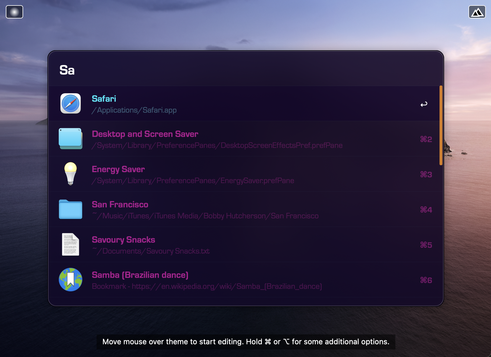
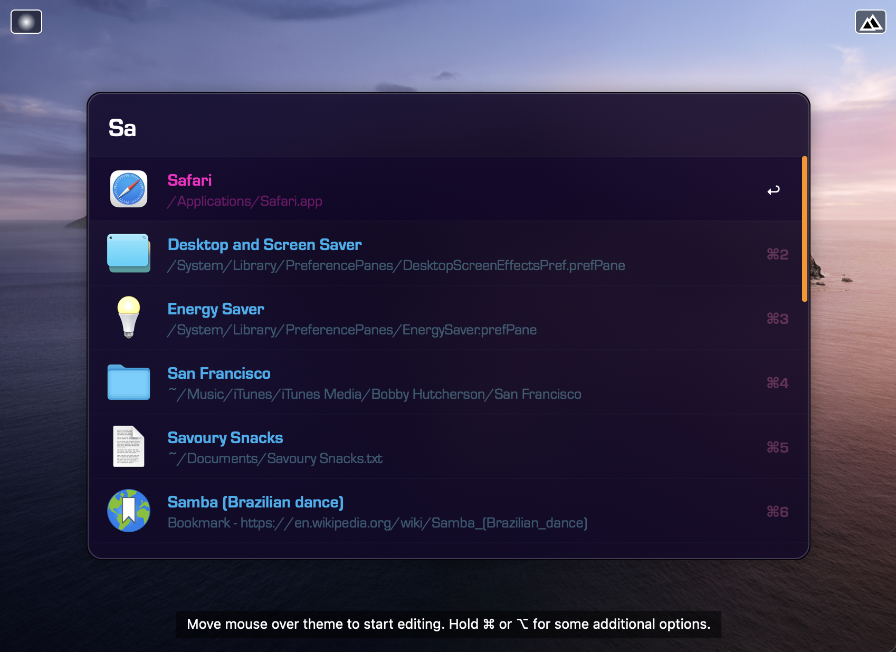
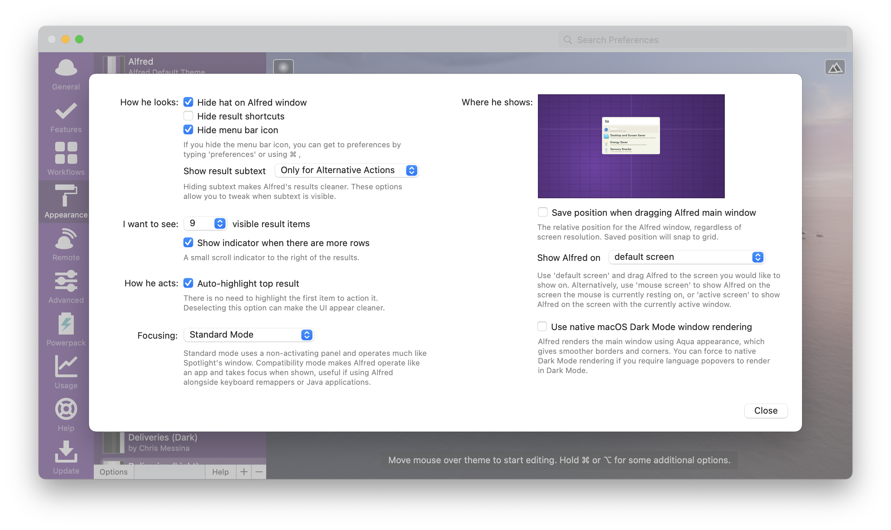
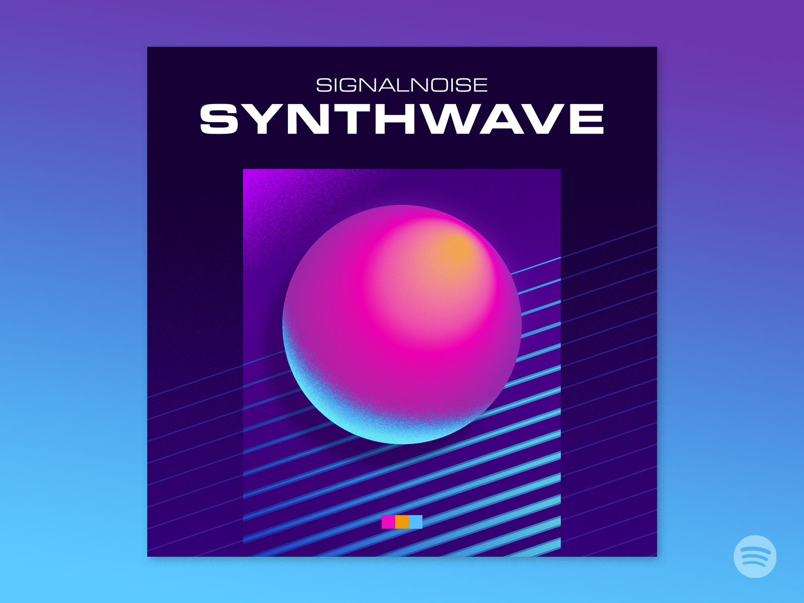

# Synthwave '85 Powerpack Theme

Here are two [Alfred Powerpack Themes](https://www.alfredapp.com/help/appearance/) inspired by [vaporwave](https://www.spotify.com/) and James White's [Signalnoise's incredible artwork](https://dribbble.com/Signalnoise), specifically his [Synthwave playlist cover art](https://dribbble.com/shots/7064951-Signalnoise-Synthwave-playlist).

These are successors to my Synthwave '84 theme and require Alfred 4.3+.

[**Download Theme**](https://github.com/chrismessina/alfred-theme-synthwave-85/releases/latest)

## Installation

This theme uses the [MicroSquare](https://fontsite.com/font-library/microsquare/) typeface from [FontSite](https://fontsite.com/). You'll need to license and install that first.

You can [download a demo](https://www.fontspring.com/fonts/fontsite/microsquare) from FontSpring or buy the entire family from FontSite directly for only $18.95!

Then [download and unzip the file above](https://github.com/chrismessina/alfred-theme-synthwave-85/releases/latest), and double-click each `.alfredappearance` file to install it.

## Preview

### Synthwave '85

### Synthrave '85

## Suggested configuration

- Disable the Alfred hat logo by checking: `Alfred Preferences › Appearance › Options › Hide hat on Alfred window`
- Disable result shortcuts by unchecking: `Alfred Preferences › Appearance › Options › Hide result shortcuts`

Simplify results by switching the result subtext to "Only for Alternative Actions".

## Inspiration

The inspiration for this theme came from James White's [Synthwave playlist cover art](https://dribbble.com/shots/7064951-Signalnoise-Synthwave-playlist):

## About

This theme is unaffiliated with nor endorsed by James White.

<a href="https://www.alfredforum.com/topic/16380-synthwave-85-inspired-theme/">Alfred Forum link</a>.
